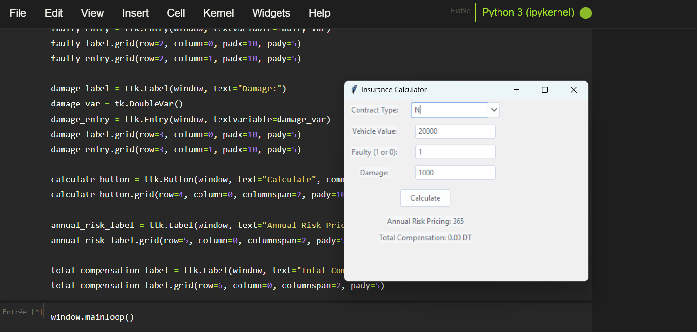

# 🏠🚗 Insurance Prediction and Compensation System

## 📌 Project Overview
This project consists of two parts: **Part 1** builds a **machine learning model** to predict potential home insurance customers using a **Random Forest Classifier**, and **Part 2** develops a **Tkinter interface** to calculate compensation for automotive insurance claims based on predefined rules. The system processes Excel data, applies preprocessing, and delivers actionable insights for insurance providers.

---

## 📂 Dataset
- **Home Insurance (Part 1)**: Excel files with columns: `CITY`, `Duration`, `has_children`, `marital_status`, `home_market_value`, `Properties_Market_Value`, `Vulnerable to theft`, `Annual_prime`, `Insured_Amount`, `Nombre_Thefts_last5years`, `Potential client`.
- **Automotive Insurance (Part 2)**: Dataframe with columns: `contract type`, `vehicle_value`, `faulty`, `damage`, `price_vehicle_new`.

---

## 🔍 Project Workflow

### **1. Part 1: Home Insurance Prediction**
Load, preprocess, and train a model to classify potential clients.

```python
import pandas as pd
from sklearn.preprocessing import LabelEncoder
from sklearn.model_selection import train_test_split
from sklearn.ensemble import RandomForestClassifier
from sklearn.metrics import classification_report

# Load and concatenate data
dt1 = pd.read_excel('home_insurance1.xlsx')
dt2 = pd.read_excel('home_insurance2.xlsx')
columns_to_extract_dt1 = ['CITY', 'Duration', 'has_children', 'marital_status', 'home_market_value', 'Properties_Market_Value', 'Vulnerable to theft', 'Potential client']
columns_to_extract_dt2 = ['Annual_prime', 'Insured_Amount', 'Nombre_Thefts_last5years']
dt = pd.concat([dt1[columns_to_extract_dt1], dt2[columns_to_extract_dt2]], axis=1)

# Encode categorical columns
le = LabelEncoder()
for column in dt.select_dtypes(include='object').columns:
    dt[column] = le.fit_transform(dt[column])

# Normalize numerical columns
numeric_cols = ['Duration', 'home_market_value', 'Properties_Market_Value', 'Vulnerable to theft', 'Annual_prime', 'Insured_Amount', 'Nombre_Thefts_last5years']
for col in numeric_cols:
    dt[col + '_norm'] = (dt[col] - dt[col].min()) / (dt[col].max() - dt[col].min())

# Fuzzy score for potential client
dt['fuzzy_score'] = (
    0.2 * dt['Duration_norm'] + 
    0.15 * dt['Properties_Market_Value_norm'] +
    0.15 * dt['Annual_prime_norm'] +
    0.1 * dt['Insured_Amount_norm'] -
    0.2 * dt['Nombre_Thefts_last5years_norm'] -
    0.1 * dt['Vulnerable to theft_norm'] +
    0.05 * dt['has_children'] +
    0.1 * np.random.normal(0, 0.05, dt.shape[0])
)
dt['Potential_client'] = (dt['fuzzy_score'] > dt['fuzzy_score'].median()).astype(int)

# Train Random Forest
X = dt[['Duration', 'has_children', 'home_market_value', 'Properties_Market_Value', 'Vulnerable to theft', 'Annual_prime', 'Insured_Amount', 'Nombre_Thefts_last5years']]
y = dt['Potential_client']
X_train, X_test, y_train, y_test = train_test_split(X, y, test_size=0.20, random_state=0)
model = RandomForestClassifier(n_estimators=100, random_state=42).fit(X_train, y_train)
print(classification_report(y_test, model.predict(X_test)))
```

### **2. Part 2: Automotive Insurance Compensation**
Calculate risk pricing and compensation for claims.

```python
def calculate_annual_risk_pricing(dataframe):
    dataframe['annual_risk_pricing'] = 0
    dataframe.loc[(dataframe['contract type'] == 'Tr') & (dataframe['vehicle_value'] > 50000), 'annual_risk_pricing'] = 1000
    dataframe.loc[(dataframe['contract type'] == 'Tr') & (dataframe['vehicle_value'] <= 50000), 'annual_risk_pricing'] = 850
    dataframe.loc[dataframe['contract type'] == 'N', 'annual_risk_pricing'] = 365
    return dataframe

def total_compensation(dataframe):
    dataframe['total_compensation'] = 0
    condition = (dataframe['contract type'] != 'N') | ((dataframe['contract type'] == 'N') & (dataframe['faulty'] == 0))
    dataframe.loc[condition, 'total_compensation'] = (dataframe['damage'] * dataframe['vehicle_value']) / dataframe['price_vehicle_new']
    return dataframe

def calculate_annual_risk_pricing(contract_type, vehicle_value):
    if contract_type == 'Tr':
        return 1000 if vehicle_value > 50000 else 850
    elif contract_type == 'N':
        return 365
    else:
        return 0

def total_compensation(contract_type, faulty, damage, vehicle_value):
    price_vehicle_new = vehicle_value + 10000

    if contract_type == 'N':
        if faulty == 1:
            return 0
        else:
            return (damage * vehicle_value) / price_vehicle_new
    elif contract_type == 'Tr':
        return (damage * vehicle_value) / price_vehicle_new
    else:
        return 0
```

### **3. Tkinter Interface**
GUI to input automotive insurance data and calculate compensation.

```python
# Main window
window = tk.Tk()
window.title("Insurance Calculator")
window.geometry("400x300")

style = ThemedStyle(window)
style.set_theme("arc")

# Create and add widgets to the window
contract_type_label = ttk.Label(window, text="Contract Type:")
contract_type_var = tk.StringVar()
contract_type_combobox = ttk.Combobox(window, textvariable=contract_type_var, values=["Tr", "N"])
contract_type_label.grid(row=0, column=0, padx=10, pady=5)
contract_type_combobox.grid(row=0, column=1, padx=10, pady=5)

vehicle_value_label = ttk.Label(window, text="Vehicle Value:")
vehicle_value_entry = ttk.Entry(window)
vehicle_value_label.grid(row=1, column=0, padx=10, pady=5)
vehicle_value_entry.grid(row=1, column=1, padx=10, pady=5)

faulty_label = ttk.Label(window, text="Faulty (1 or 0):")
faulty_var = tk.IntVar()
faulty_entry = ttk.Entry(window, textvariable=faulty_var)
faulty_label.grid(row=2, column=0, padx=10, pady=5)
faulty_entry.grid(row=2, column=1, padx=10, pady=5)

damage_label = ttk.Label(window, text="Damage:")
damage_var = tk.DoubleVar()
damage_entry = ttk.Entry(window, textvariable=damage_var)
damage_label.grid(row=3, column=0, padx=10, pady=5)
damage_entry.grid(row=3, column=1, padx=10, pady=5)

calculate_button = ttk.Button(window, text="Calculate", command=update_results)
calculate_button.grid(row=4, column=0, columnspan=2, pady=10)

annual_risk_label = ttk.Label(window, text="Annual Risk Pricing: ")
annual_risk_label.grid(row=5, column=0, columnspan=2, pady=5)

total_compensation_label = ttk.Label(window, text="Total Compensation: ")
total_compensation_label.grid(row=6, column=0, columnspan=2, pady=5)
```

---

## 📊 Results
- **Part 1 (Home Insurance)**:
  ```
              precision    recall  f1-score   support
           0       0.99      0.98      0.99      1424
           1       0.98      0.99      0.98      1376
    accuracy                           0.98      2800
  ```
- **Part 2 (Automotive Insurance)**: Compensation calculator output shown in GUI.
- **Capture**: 

---

## 📦 Requirements
```bash
pip install pandas numpy scikit-learn tkinter
```

---

## 📌 Key Insights
- **Random Forest** achieves 98% accuracy in predicting potential home insurance clients.
- Fuzzy scoring incorporates weighted features for robust classification.
- Tkinter interface simplifies automotive insurance compensation calculations.
- Rule-based compensation logic ensures accurate claim estimations.

---

## 📜 License
MIT License
